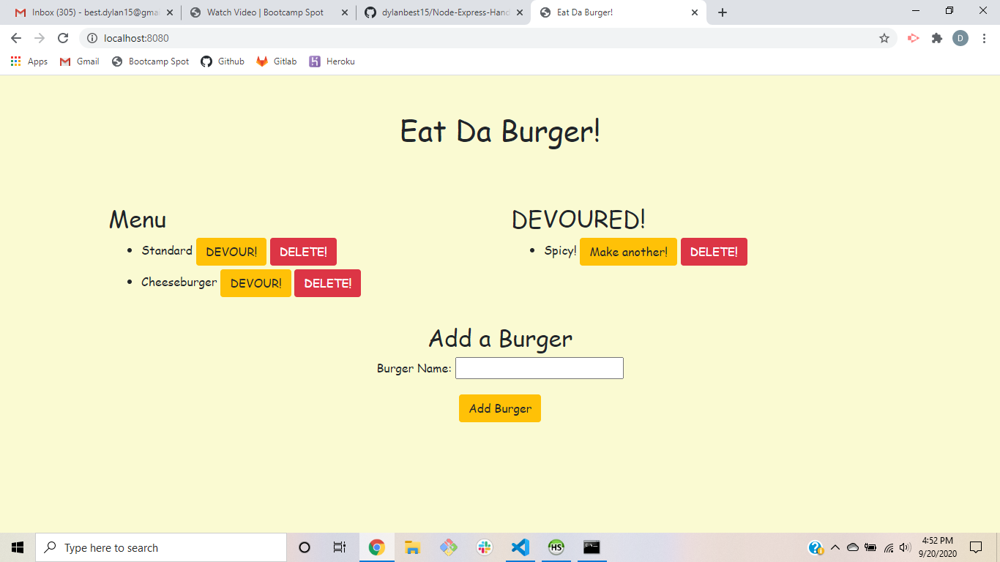

# Node-Express-Handlebars
This website utilizes MySQL and Express server with express-handlebars in order to create, read, update, and delete (CRUD) from a database while dynamically altering the website. It features a menu with a "DEVOURED!" section. The user can choose to add a new burger to the menu which will then add that burger to the databse. Then, the user may "devour" the burger (updating the "devoured" boolean) or delete the burger. The website will create menu list items dynamically on the page with the user's actions.

## Built With
- <a href="https://www.mysql.com/">MySQL</a>
- <a href="https://www.npmjs.com/package/express">Express NPM</a>
- <a href="https://www.npmjs.com/package/express-handlebars">Express-Handlebars NPM</a>

## Screenshots

## License
Copyright ©2020 Dylan Best

Permission is hereby granted, free of charge, to any person obtaining a copy of this software and associated documentation files (the "Software"), to deal in the Software without restriction, including without limitation the rights to use, copy, modify, merge, publish, distribute, sublicense, and/or sell copies of the Software, and to permit persons to whom the Software is furnished to do so, subject to the following conditions:

The above copyright notice and this permission notice shall be included in all copies or substantial portions of the Software.

THE SOFTWARE IS PROVIDED "AS IS", WITHOUT WARRANTY OF ANY KIND, EXPRESS OR IMPLIED, INCLUDING BUT NOT LIMITED TO THE WARRANTIES OF MERCHANTABILITY, FITNESS FOR A PARTICULAR PURPOSE AND NONINFRINGEMENT. IN NO EVENT SHALL THE AUTHORS OR COPYRIGHT HOLDERS BE LIABLE FOR ANY CLAIM, DAMAGES OR OTHER LIABILITY, WHETHER IN AN ACTION OF CONTRACT, TORT OR OTHERWISE, ARISING FROM, OUT OF OR IN CONNECTION WITH THE SOFTWARE OR THE USE OR OTHER DEALINGS IN THE SOFTWARE.

## Authors
- **Dylan Best** - [dylanbest15](https://github.com/dylanbest15)